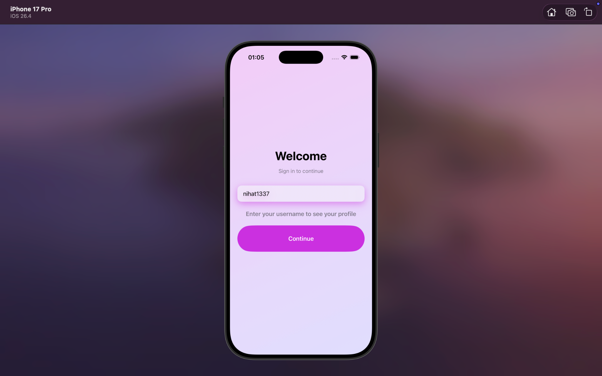
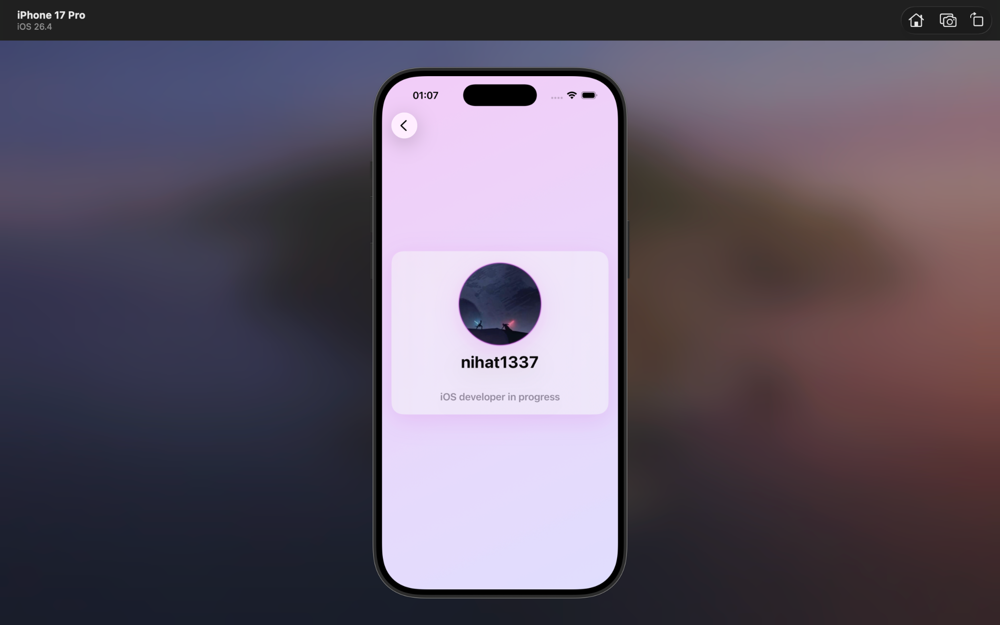

# GHProfile

A modern SwiftUI application that fetches and displays GitHub user profiles using the GitHub REST API.

## Features

- Search GitHub users by username
- Fetch real-time profile data from GitHub API
- Display user avatar, username, bio, and profile information
- Clean and modern SwiftUI interface
- MVVM Architecture
- Async/Await networking
- Error handling and loading states
- Smooth screen transitions and animations

---

## Architecture

This project follows the **MVVM**

### Models

Responsible for representing GitHub API responses.

```text
Models/
 └── User.swift
```

### Views

Responsible for rendering the UI.

```text
View/
 ├── LoginView.swift
 ├── ProfileView.swift
 └── Components
```

### ViewModels

Responsible for business logic, state management, and communication between Views and API services.

```text
ViewModels/
 └── ProfileViewModel.swift
```

---

## API Integration

This project uses the official GitHub REST API.

### Endpoint

```http
GET https://api.github.com/users/{username}
```

### Example

```http
GET https://api.github.com/users/nihat1337
```

### Sample Response

```json
{
  "login": "nihat1337",
  "avatar_url": "...",
  "bio": "...",
}
```

The application performs network requests using:

- URLSession
- Async/Await
- Codable for JSON decoding

---

## Technologies Used

- Swift
- SwiftUI
- MVVM
- URLSession
- Async/Await
- Codable
- GitHub REST API

---

## App

### Login Screen

<p align="center">
  
</p>

### Profile Screen

<p align="center">
  
</p>

---

## Project Structure

```text
GHProfile
│
├── Models
│   └── User.swift
│
├── View
│   ├── LoginView.swift
│   └── ProfileView.swift
│
├── ViewModels
│   └── ProfileViewModel.swift
│
├── Assets.xcassets
│
└── GHProfileApp.swift
```

---

## Getting Started

1. Clone the repository

```bash
git clone https://github.com/nihat1337/GHProfile.git
```

2. Open the project in Xcode

```bash
open GHProfile.xcodeproj
```

3. Run on Simulator or Physical Device

---

## Author

**Nihad Samedov**

iOS Developer in Progress 🚀
